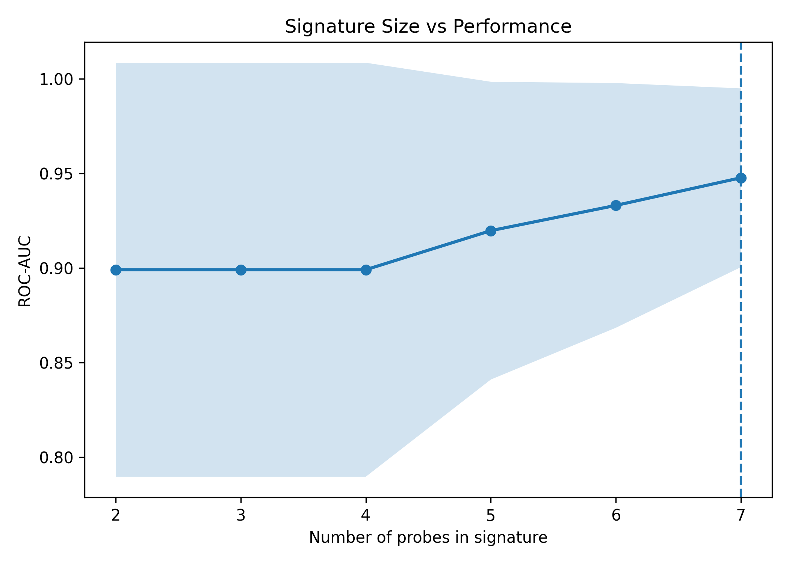

# Endometriosis Gene Signature Discovery

## Overview

This project builds a reproducible pipeline to identify a compact gene expression signature associated with endometriosis using public transcriptomic datasets.

The goal is not only to obtain good predictive performance, but to understand how much of the disease signal can be captured by a small and interpretable set of genes, and how well that signal transfers across independent datasets and experimental platforms.

---

## Datasets

### Training dataset
- GEO: GSE51981
- Platform: Affymetrix GPL570 microarray
- Task: endometriosis vs healthy controls

### External validation datasets
- GSE135485
  - Platform: RNA-seq
  - Purpose: cross-platform validation
- GSE25628
  - Platform: GPL571 microarray
  - Purpose: cross-study validation

---

## Pipeline

### 1. Data preparation
The training dataset is built by loading the GEO expression matrix, parsing metadata from XML, and merging sample-level annotations with gene expression values.

### 2. Cohort cleaning
The original study contains heterogeneous controls. To reduce confounding, the analysis keeps:
- patients with endometriosis
- healthy controls without uterine pelvic pathology

This produces a cleaner and more interpretable classification problem.

### 3. Baseline modeling
The main baseline uses:
- variance filtering
- standardization
- logistic regression
- 5-fold cross-validation

### 4. Feature stability analysis
Instead of trusting a single model fit, features are ranked according to how consistently they appear across cross-validation folds.

This identifies a stable subset of predictive probes rather than one-off correlations.

### 5. Annotation and ranking
Stable probes are mapped to gene symbols using GPL570 annotation, then ranked using:
- cross-validation stability
- coefficient magnitude

### 6. Signature extraction
A compact signature is derived from the top-ranked probes.

### 7. Signature size analysis
The number of genes is varied and model performance is tracked to determine where the signal saturates.

### 8. Sparse signature analysis
L1-regularized logistic regression is used to test whether the signature can be compressed further into an even smaller subset of genes.

### 9. External validation
The resulting signatures are tested on:
- an RNA-seq dataset
- an independent microarray dataset

This evaluates robustness across both studies and platforms.

---

## Main Results

### Summary table

| Signature | Dataset | Platform | Genes used | Samples | ROC-AUC | Interpretation |
|---|---|---:|---:|---:|---:|---|
| Ranked signature | Internal CV | Microarray | ~7 | 109 | ~0.95 | Best overall internal result |
| Ranked signature | GSE135485 | RNA-seq | 6 | 58 | 0.66 | Partial cross-platform transfer |
| Ranked signature | GSE25628 | Microarray | 2 | 14 | 0.77 | Good cross-study transfer |
| L1 sparse signature | Internal CV | Microarray | 3 | 109 | 0.91 | Strong sparse core |
| L1 sparse signature | GSE135485 | RNA-seq | 3 | 58 | 0.42 | Too compressed for cross-platform transfer |
| L1 sparse signature | GSE25628 | Microarray | 1 | 14 | 0.90 | Strong but fragile single-gene transfer |

---

## Signature Size Analysis



To understand how many genes are needed to capture the predictive signal, model performance was evaluated as a function of signature size.

### Results

- Performance increases as genes are added
- A plateau is reached at approximately **6–8 genes**
- Adding more genes beyond this range does not improve ROC-AUC

### Interpretation

This behavior indicates that the predictive signal is **low-dimensional**.

---

## Sparse Signature via L1 Regularization

### Results

- L1-regularized logistic regression selects a minimal subset of **3 genes**
- ROC-AUC ≈ **0.91 ± 0.09**
- Selected genes:
  - ZNF24  
  - HMGN3-AS1  
  - ZNF568  

### Interpretation

The signal is **genuinely sparse**, but the minimal signature is **less robust across datasets**, indicating that additional genes provide stabilizing redundancy.

---

## External Validation

### GSE135485 (RNA-seq)
- Ranked signature ROC-AUC: 0.66
- Sparse L1 signature ROC-AUC: 0.42

### GSE25628 (microarray)
- Ranked signature ROC-AUC: 0.77
- Sparse L1 signature ROC-AUC: 0.90

### Overall interpretation

1. The signal can be captured by a compact signature  
2. It generalizes better across studies than platforms  
3. Strong compression reduces robustness  

---

## Differential Expression Analysis

To complement the predictive analysis, differential expression was computed between cases and controls.

- ~90 up-regulated genes  
- ~100 down-regulated genes  

After probe-to-gene mapping and filtering, these lists were used for biological interpretation.

---

## Pathway Enrichment

### Up-regulated genes

Enrichment analysis highlights:

- cell cycle and mitotic processes  
- DNA replication  
- chromosome organization  

### Down-regulated genes

Enrichment analysis highlights:

- extracellular matrix (ECM) organization  
- cell adhesion  
- immune and signaling pathways  

---

## Biological Interpretation

The results reveal a coordinated shift in cellular programs:

- **Up-regulation of proliferation and cell cycle activity**
- **Down-regulation of structural and immune-related processes**

This suggests a transition toward a **proliferative and less differentiated state**, consistent with:

- tissue remodeling  
- ectopic growth  
- altered cell–environment interactions  

---

## Drug Enrichment Analysis

Drug enrichment was performed using Enrichr and L1000.

### Key observations

- Strong enrichment for **cardiac glycosides** (e.g., digoxin, ouabain)
- Enrichment for **anti-inflammatory and signaling modulators**
- Overlapping genes include:
  - EGR1  
  - JUNB  
  - FOSB  
  - RELA  

These genes are part of:

- AP-1 transcriptional response  
- NF-κB signaling pathways  

### Interpretation

The gene signature reflects a **transcriptional stress and inflammatory activation program**.

Drug perturbation results show that many compounds can **induce similar expression patterns**, but:

- no strong reversing compounds were identified  
- the signal appears **diffuse and regulatory**, rather than linked to a single druggable target  

---

## Core Genes

Main signature:
- CTU2
- ZNF24
- NT5DC3
- HMGN3-AS1
- ZNF568
- C11orf54

Sparse core:
- ZNF24
- HMGN3-AS1
- ZNF568

---

## Project Structure

```text
.
├── data/
│   ├── raw/
│   └── processed/
├── scripts/
│   ├── build_dataset.py
│   ├── run_signature.py
│   ├── run_signature_l1.py
│   ├── validate_gse135485.py
│   ├── validate_gse25628.py
│   ├── plot_roc_all.py
│   └── plot_signature_size.py
├── src/
│   └── endometriosis_signature/
├── results/
│   └── figures/
└── README.md
```

---

## Usage

```bash
pip install -e .

python scripts/build_dataset.py
python scripts/run_signature.py
python scripts/run_signature_l1.py
python scripts/validate_gse135485.py
python scripts/validate_gse25628.py
python scripts/plot_signature_size.py
python scripts/plot_roc_all.py
```

---

## Data Availability

Download from GEO:
- GSE51981
- GSE135485
- GSE25628

Place in:
```
data/raw/
```

---

## Limitations

- Small external datasets  
- RNA-seq dataset is highly imbalanced  
- Cross-platform transfer remains difficult  
- Drug enrichment is associative, not predictive  

---

## Future Work

- Larger validation cohorts  
- RNA-seq training  
- pathway-level modeling  
- improved normalization strategies  
- deeper biological interpretation  

---

## Conclusion

Endometriosis-related transcriptional signal can be captured by a compact and stable gene signature.

Key findings:

- the signal is low-dimensional  
- a small number of genes captures most predictive power  
- a sparse core exists but reduces robustness  
- biological interpretation indicates a shift toward **proliferative and regulatory activation states**  
- the signal is consistent but not easily reversed by single-drug perturbations  

This highlights both the potential and limitations of machine learning approaches for transcriptomic biomarker discovery.
