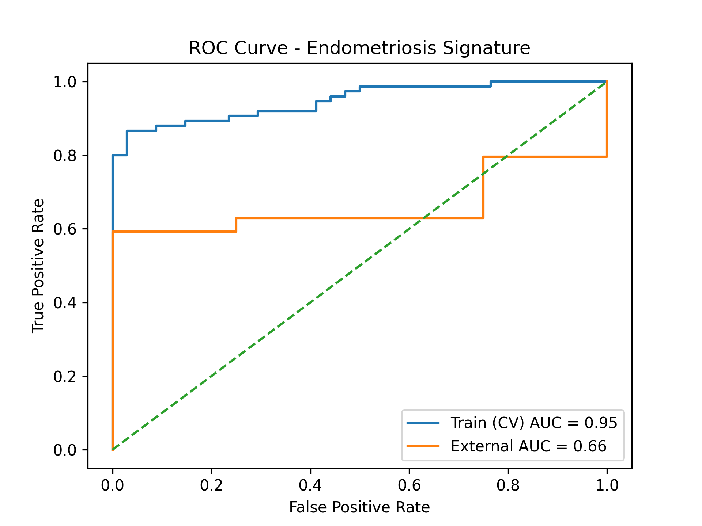

# Endometriosis Gene Signature Discovery

## Overview

This project implements a reproducible pipeline to identify a compact gene expression signature associated with endometriosis using publicly available transcriptomic data.

The approach combines data preprocessing, machine learning, feature stability analysis, and biological annotation to extract a minimal set of genes that collectively capture disease-related signal.

The objective is not only predictive performance, but also interpretability and robustness across datasets.

---

## Datasets

### Training Dataset
- GEO: GSE51981  
- Platform: Affymetrix GPL570 (microarray)  
- Samples: Endometriosis vs healthy controls  

### External Validation Dataset
- GEO: GSE135485  
- Platform: RNA-seq  
- Used for cross-dataset validation  

---

## Methodology

### 1. Data Preparation
- Expression matrix transposed to (samples × genes)
- Metadata extracted from GEO XML
- Binary classification target:
  - `1` → Endometriosis  
  - `0` → Healthy  

### 2. Cohort Filtering
To reduce confounding:
- Included:
  - Endometriosis patients  
  - Healthy controls without uterine pathology  
- Excluded:
  - Other pathological conditions  

---

### 3. Baseline Model
- Logistic regression
- Variance filtering
- Standard scaling
- 5-fold cross-validation

---

### 4. Feature Stability Analysis
- Model trained across CV folds
- Top features selected per fold
- Feature occurrence counted

This identifies **stable predictors** rather than noisy correlations.

---

### 5. Feature Ranking
Features are ranked based on:
- Stability across folds  
- Coefficient magnitude  

---

### 6. Signature Extraction
A compact gene signature is constructed from the top-ranked features.

---

### 7. Signature Size Optimization
Performance is evaluated as a function of signature size:

- 2–14 genes tested  
- ROC-AUC computed for each  
- Plateau identified  

---

## Key Results

### Internal Validation (GSE51981)
- Full model (54k features):  
  - ROC-AUC ≈ 0.93  

- Compact signature (~7 genes):  
  - ROC-AUC ≈ 0.95  

### Interpretation
- Signal is **low-dimensional**
- Additional features are redundant
- A small subset captures most predictive information

---

## External Validation (GSE135485)

### Setup
- Train: microarray dataset (GSE51981)  
- Test: RNA-seq dataset (GSE135485)  
- Features: 6 overlapping genes  
- Preprocessing: log1p transform on RNA-seq  

### Results
- ROC-AUC: **0.66**  
- PR-AUC: **0.97** *(inflated due to imbalance: 54 positives / 4 negatives)*  

### Interpretation
- Signal partially generalizes across datasets  
- Performance drops due to:
  - platform differences (microarray vs RNA-seq)
  - cohort differences
  - extreme class imbalance  

This behavior is consistent with known challenges in transcriptomic machine learning.

---

## ROC Curve



The figure illustrates:
- strong internal performance  
- reduced external performance  
- expected generalization gap  

---

## Identified Signature (Dataset-Specific)

The final signature includes genes such as:

- CTU2  
- ZNF24  
- NT5DC3  
- HMGN3-AS1  
- ZNF568  
- C11orf54  

This represents a **distributed transcriptional signature**, rather than a single biomarker.

---

## Project Structure

```
.
├── data/
│   ├── raw/
│   └── processed/
├── scripts/
│   ├── build_dataset.py
│   ├── run_signature.py
│   └── validate_external.py
├── src/
│   └── endometriosis_signature/
├── results/
│   └── figures/
└── README.md
```

---

## Usage

Install:

```
pip install -e .
```

Run pipeline:

```
python scripts/build_dataset.py
python scripts/run_signature.py
python scripts/validate_external.py
```

---

## Data Availability

Raw data is not included due to size constraints.

Download from GEO:

- GSE51981: https://www.ncbi.nlm.nih.gov/geo/query/acc.cgi?acc=GSE51981  
- GSE135485: https://www.ncbi.nlm.nih.gov/geo/query/acc.cgi?acc=GSE135485  

Place files in:

```
data/raw/
```

---

## Limitations

- Dataset-specific signature  
- Limited external validation (only 4 controls)  
- Cross-platform differences  
- No pathway-level interpretation yet  

---

## Future Work

- External validation on balanced datasets  
- Pathway enrichment analysis  
- Sparse models (L1 regularization)  
- Multi-dataset integration  

---

## Conclusion

This project demonstrates that endometriosis-related transcriptional patterns can be captured by a compact and stable gene signature.

The results highlight:
- strong internal predictive signal  
- reduced but meaningful cross-dataset generalization  
- the importance of stability and dimensionality reduction in high-dimensional biological data
