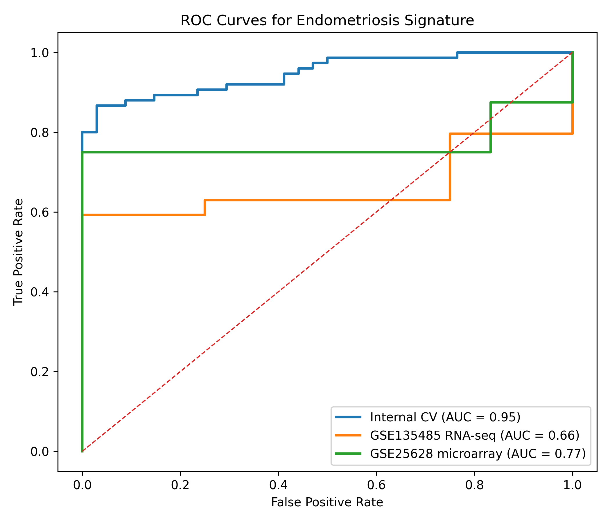

# Endometriosis Gene Signature Discovery

## Overview

This project aims to identify a compact and robust gene expression signature associated with endometriosis using publicly available transcriptomic datasets.

The goal is to extract a minimal, interpretable set of genes that retains predictive power while generalizing across independent datasets and experimental platforms.

---

## Datasets

### Training Dataset
- GEO: GSE51981  
- Platform: Affymetrix GPL570 (microarray)  
- Samples: Endometriosis vs healthy controls  

### External Validation Datasets

**1. RNA-seq (cross-platform validation)**  
- GEO: GSE135485  
- Platform: RNA-seq  

**2. Microarray (cross-study validation)**  
- GEO: GSE25628  
- Platform: GPL571 (microarray)  

---

## Methodology

### 1. Data Cleaning and Cohort Definition

The original dataset contained heterogeneous control groups. To reduce confounding:

- Included:
  - Endometriosis patients  
  - Healthy controls without uterine pathology  

- Excluded:
  - Other pathological conditions  

---

### 2. Baseline Modeling

- Logistic Regression  
- Variance filtering  
- Standard scaling  
- 5-fold cross-validation  

---

### 3. Feature Stability Analysis

Features were selected based on **stability across cross-validation folds**, rather than a single model fit.

This reduces overfitting and identifies consistently predictive genes.

---

### 4. Signature Extraction

A compact gene signature was derived from the most stable and predictive features.

---

### 5. Signature Size Optimization

- Performance plateau observed at ~7 genes  
- Indicates a **low-dimensional biological signal**

---

## Key Results

### Summary Table

| Dataset            | Platform    | Genes Used | Samples | ROC-AUC | Notes |
|-------------------|------------|------------|--------|--------|------|
| Internal (CV)     | Microarray | ~7         | 109    | ~0.94  | Clean cohort |
| GSE135485         | RNA-seq    | 6          | 58     | 0.66   | Strong imbalance (54 vs 4) |
| GSE25628          | Microarray | 2          | 14     | **0.77** | Independent study |

---

### Internal Validation (GSE51981)
- ROC-AUC ≈ **0.93–0.95**
- Compact signature matches full model (~50k features)

---

## Signature Size Analysis


To evaluate the number of genes required to capture the predictive signal, model performance was analyzed as a function of signature size.

### Results

- Performance improves as more genes are added
- A plateau is reached at approximately **7 genes**
- Adding additional genes does not improve ROC-AUC

### Interpretation

This indicates that the endometriosis signal is **low-dimensional** and can be captured by a small subset of genes.

Even though the original dataset contains tens of thousands of features, most of the predictive information is concentrated in a compact signature.

This result supports the use of minimal gene panels for downstream applications such as biomarker development.  

---

## External Validation

### RNA-seq Dataset (GSE135485)
- ROC-AUC: **0.66**
- PR-AUC: **0.97** (inflated due to imbalance)

**Interpretation:**
- Performance decreases due to:
  - platform shift (microarray → RNA-seq)
  - distribution differences
  - class imbalance  
- Still above random → signal partially generalizes  

---

### Microarray Dataset (GSE25628)
- ROC-AUC: **0.77**
- PR-AUC: **0.89**
- Samples: 14 (8 pathological vs 6 controls)

**Important:**
- Only **2 genes** overlap with the signature:
  - ZNF24  
  - NT5DC3  

**Interpretation:**
- Strong generalization across independent dataset  
- Minimal gene subset still predictive  
- Confirms robustness of the signal  

---

## ROC Curves



This figure shows:

- Strong internal performance  
- Degradation across platforms (RNA-seq)  
- Robust transfer across independent microarray dataset  

---

## Identified Signature (Core Genes)

- CTU2  
- ZNF24  
- NT5DC3  
- HMGN3-AS1  
- ZNF568  
- C11orf54  

These form a **distributed transcriptional signature**, rather than a single biomarker.

---

## Key Insights

- The predictive signal is **low-dimensional**
- A small number of genes captures most of the information  
- The signature:
  - generalizes across studies  
  - degrades across platforms  
- Cross-platform transfer remains a key challenge in transcriptomics  

---

## Project Structure

```
.
├── data/
│   ├── raw/
│   └── processed/
├── scripts/
│   ├── build_dataset.py
│   ├── run_signature.py
│   ├── validate_external.py
│   ├── validate_gse25628.py
│   └── plot_roc_all.py
├── src/
│   └── endometriosis_signature/
├── results/
│   └── figures/
└── README.md
```

---

## Usage

Install:

```
pip install -e .
```

Run full pipeline:

```
python scripts/build_dataset.py
python scripts/run_signature.py
python scripts/validate_external.py
python scripts/validate_gse25628.py
python scripts/plot_roc_all.py
```

---

## Data Availability

Raw data is not included due to size constraints.

Download from GEO:

- https://www.ncbi.nlm.nih.gov/geo/query/acc.cgi?acc=GSE51981  
- https://www.ncbi.nlm.nih.gov/geo/query/acc.cgi?acc=GSE135485  
- https://www.ncbi.nlm.nih.gov/geo/query/acc.cgi?acc=GSE25628  

Place files in:

```
data/raw/
```

---

## Limitations

- Small external validation sets  
- Class imbalance (RNA-seq dataset)  
- Cross-platform variability  
- No pathway-level interpretation  

---

## Future Work

- Validate on larger balanced datasets  
- Perform pathway enrichment analysis  
- Explore sparse models (L1 regularization)  
- Integrate multiple datasets  

---

## Conclusion

This project demonstrates that endometriosis-related transcriptional patterns can be captured by a compact and stable gene signature.

The results highlight:

- strong internal predictive signal  
- robust cross-study generalization  
- reduced cross-platform transferability  

Overall, this work illustrates both the potential and limitations of machine learning approaches in transcriptomic biomarker discovery.
